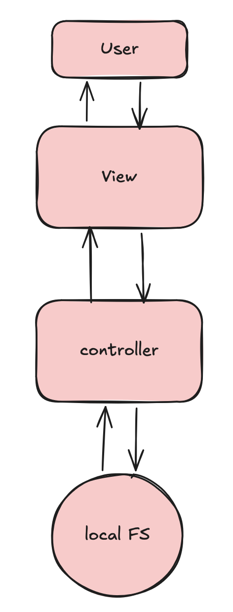

#Web-Filesystem

##A toy project that allows FS operations through a web UI.

This project is merely a learning project to familiarize myself with Ruby and Rails. *No AI is used*.

The project is separated into 2 branches:
- main
- first-iteration

The first-iteration branch is just to familiarize myself with the tools available to the ruby ecosystem, this
will not include any rails-relavant code.

The main branch is the application.

